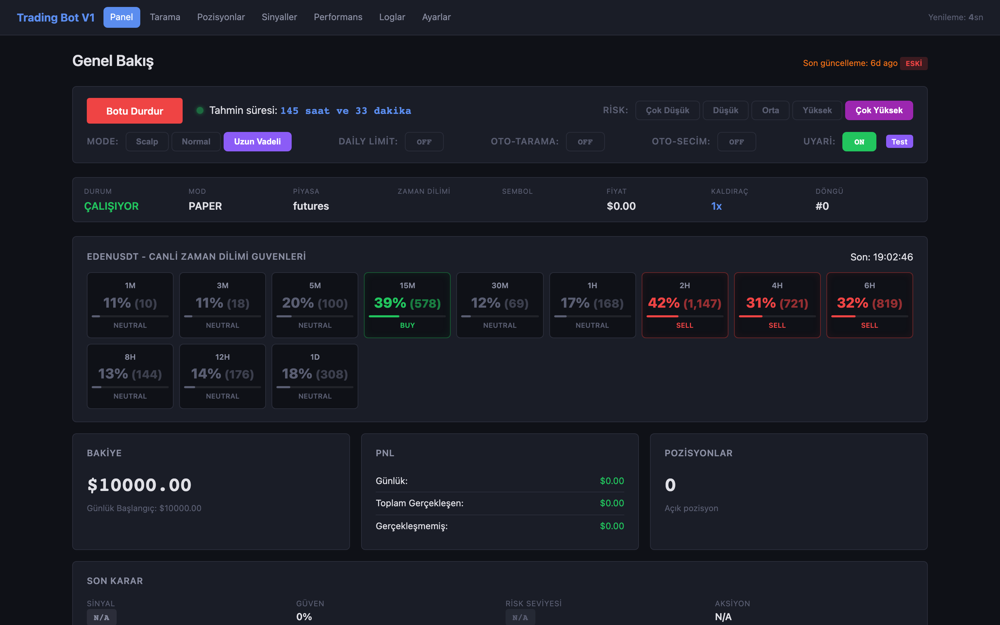
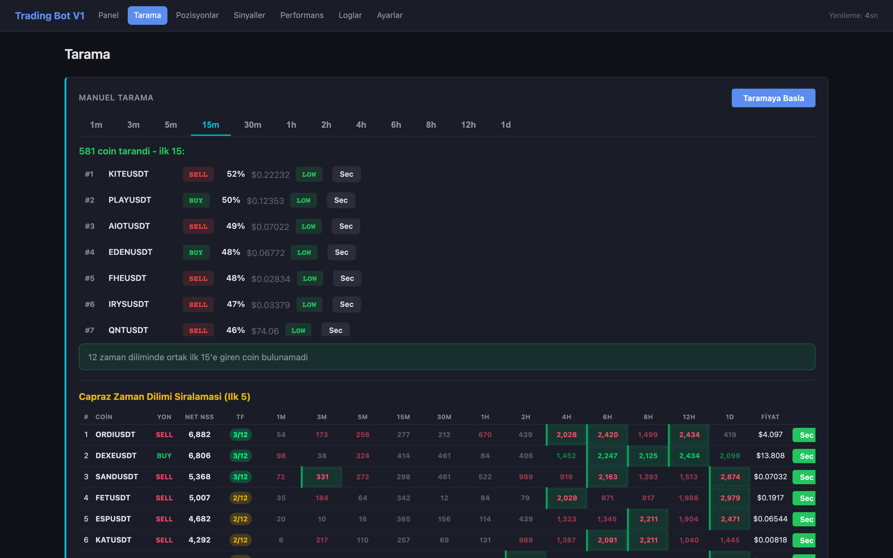
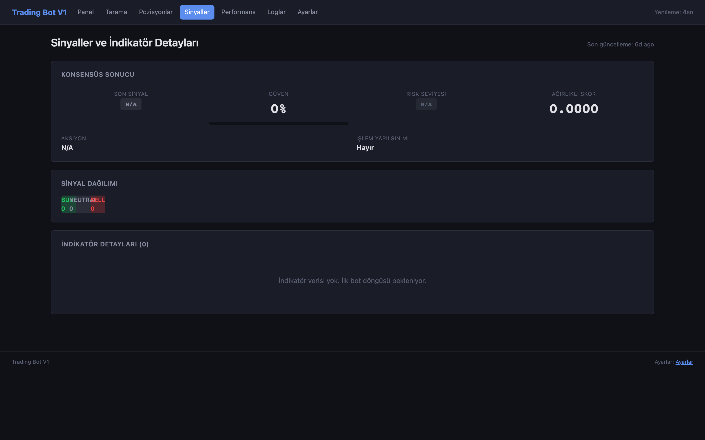
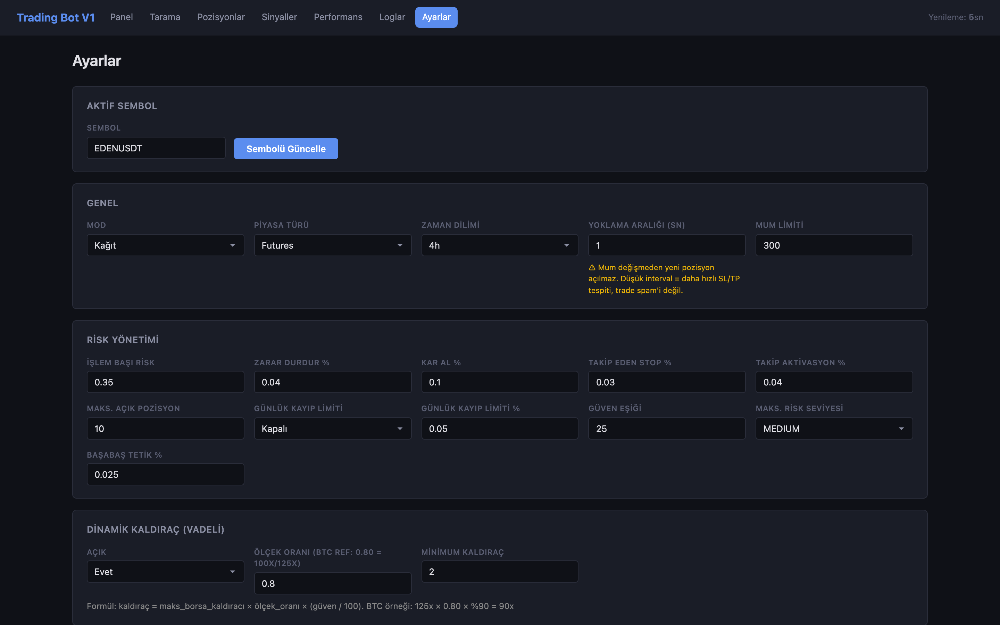

# TRADING-BOT (TBV1)

**A trading bot that won't trade until 15 indicators across 12 timeframes agree.** Paper-mode by default — live trading must be explicitly enabled per credential. Python backend, 7-tab web dashboard, macOS and Windows packaged distributions.

- 📊 **15 indicators** voting via consensus (RSI, MACD, Bollinger, SMA, EMA, Stochastic, ADX, CCI, ATR, OBV, Williams %R, VWAP, Ichimoku, PSAR, KDJ)
- 🌀 **12 timeframes** scanned per symbol (1m, 3m, 5m, 15m, 30m, 1h, 2h, 4h, 6h, 8h, 12h, 1d) with per-TF confidence
- 🛡️ **Paper-mode by default** — live trading must be explicitly enabled per credential
- 💻 **macOS reference build** + **Windows packaged distribution** (PyInstaller `--onedir` + 20 Turkish error codes + desktop shortcut creator)
- 🇹🇷 Turkish UI (`Genel Bakış / Tarama / Pozisyonlar / Sinyaller / Performans / Loglar / Ayarlar`)

> MIT licensed. macOS launcher at `~/Desktop/Projeler/proje/yedek/Trading Bot TBV1.app`; Windows install via `windows/build_windows.bat`.

## Preview

| Genel Bakış (Overview) | Tarama (Multi-symbol scan) |
| --- | --- |
|  |  |

| Sinyaller (Signal history) | Ayarlar (Settings) |
| --- | --- |
|  |  |

The dashboard is a FastAPI app served at `127.0.0.1:8081`. Both macOS and
Windows builds wrap the same Python code; the dashboard markup is identical.

## Subdirectories

- [`macOS/`](macOS/README.md) — original development build (April 2026)
- [`windows/`](windows/README.md) — packaged distribution with installer, icons, and Turkish error codes (May 2026)

## Status

Paper-mode is the default. Live trading on a credentialed perpetual-futures
account requires explicit opt-in via `Ayarlar` → `Mode = LIVE` and a per-
credential confirmation prompt.

## License

MIT — see [LICENSE](LICENSE).
