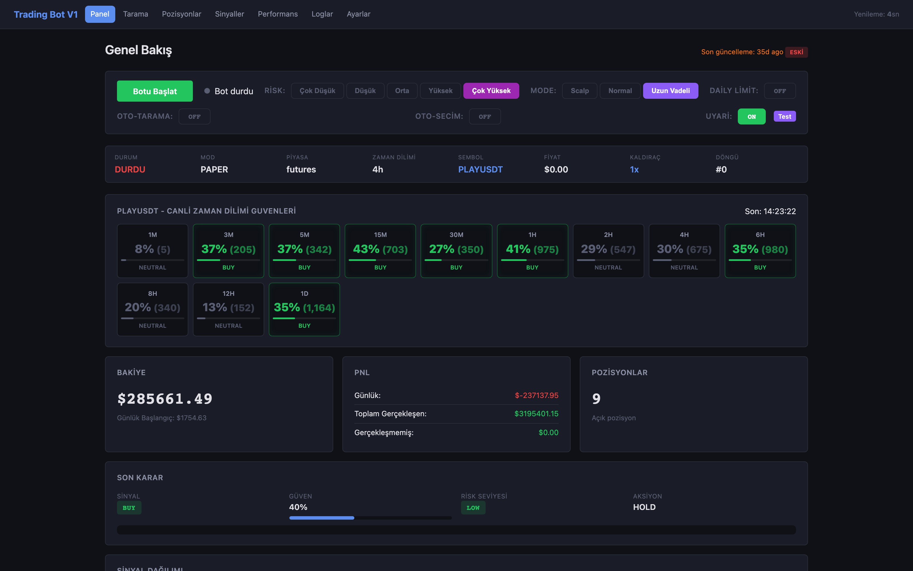
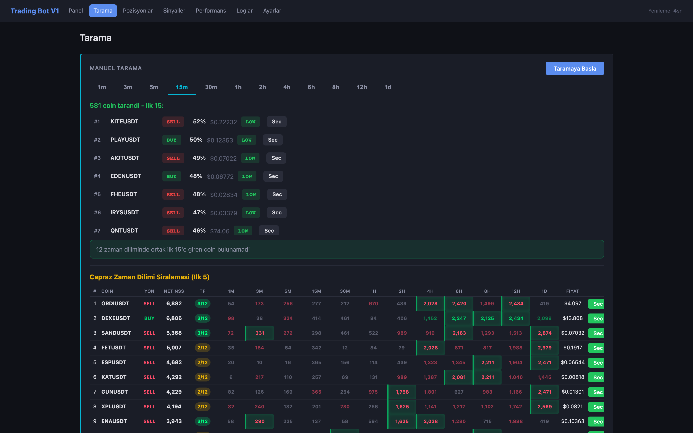
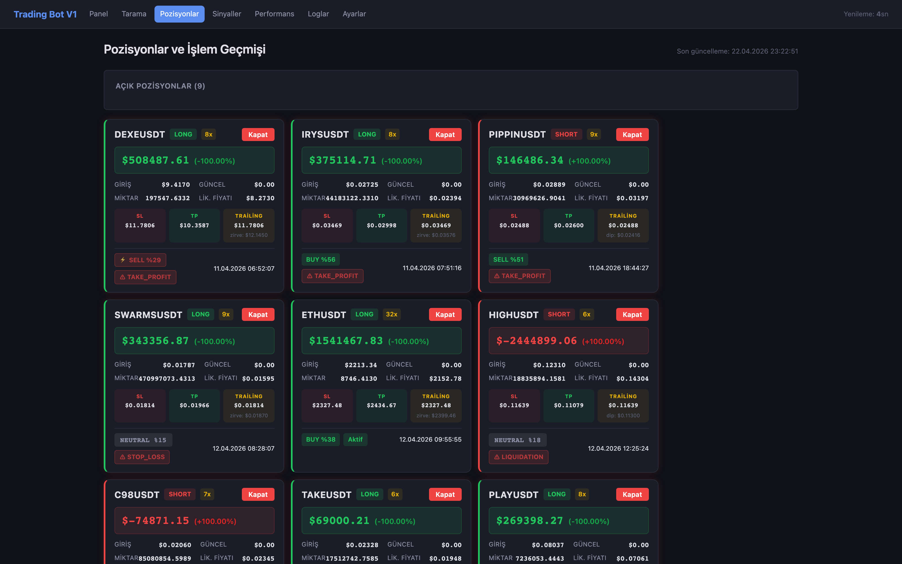
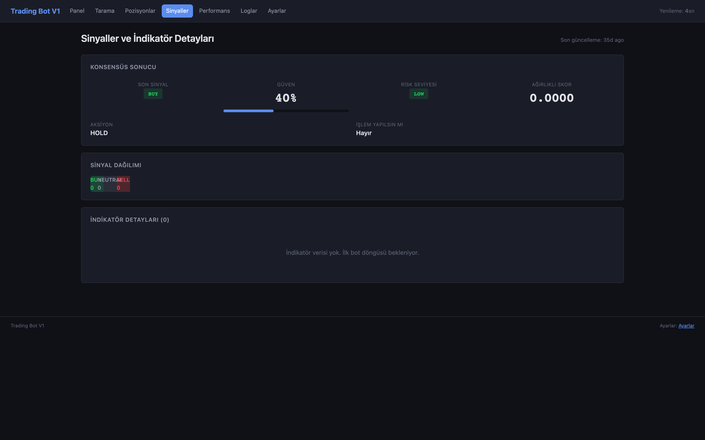
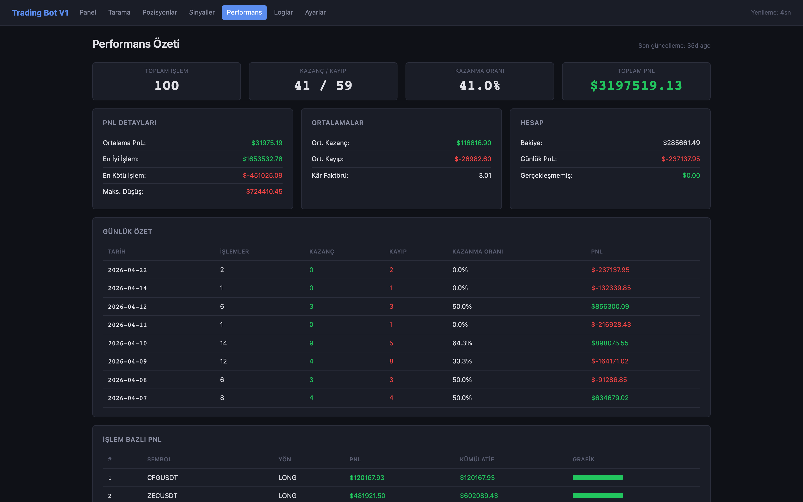
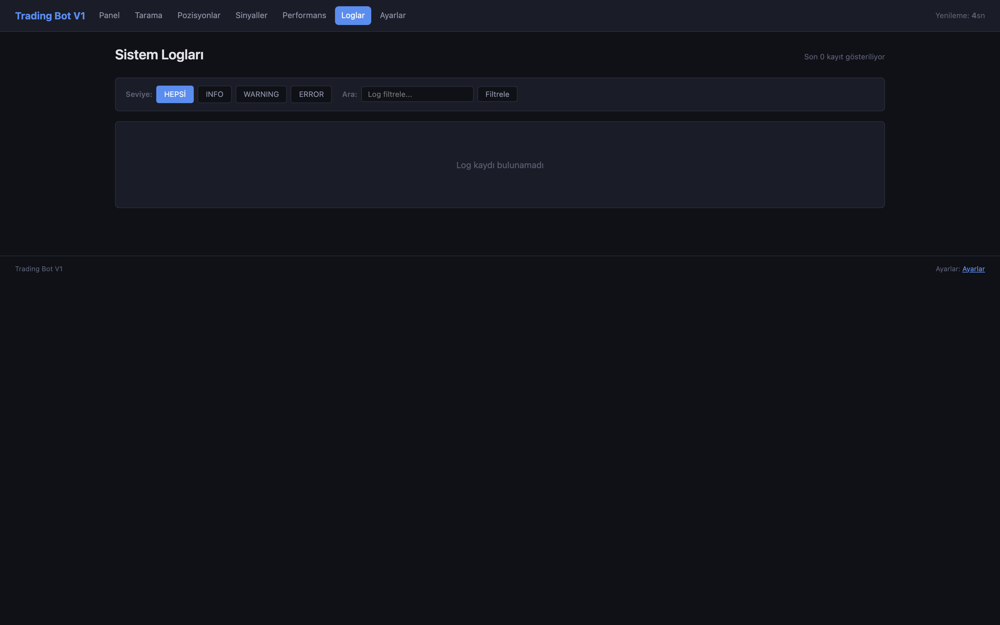
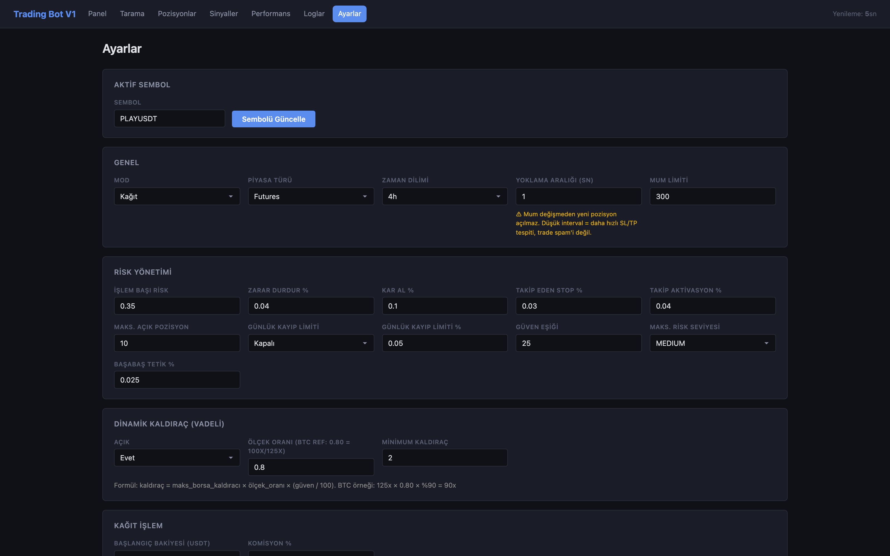

# Trading Bot — Multi-Coin, Multi-Timeframe Indicator-Consensus Engine

**A trading bot that won't trade until 15 indicators agree across 12 timeframes — on every coin on the market.** It scans the entire Binance USDT-margined perpetual-futures universe, runs a 15-indicator weighted consensus on all 12 timeframes for each coin, and cross-ranks the results to surface the coins with the strongest, most consistent multi-timeframe signal. Paper-mode by default; live trading must be explicitly enabled per credential. Python backend, 7-tab web dashboard, macOS and Windows packaged distributions.

> **15 indicators × 12 timeframes × every coin on the market.**

- 📊 **15 indicators** voting via consensus (RSI, MACD, Bollinger, SMA, EMA, Stochastic, ADX, CCI, Williams %R, ROC, MFI, ATR, Ichimoku, PSAR, OBV)
- 🌀 **12 timeframes** scanned per symbol (1m, 3m, 5m, 15m, 30m, 1h, 2h, 4h, 6h, 8h, 12h, 1d) with per-timeframe confidence
- 🌐 **Whole-market scan** — every listed USDT-futures coin, cross-ranked by multi-timeframe agreement (net NSS)
- 🛡️ **Paper-mode by default** — live trading must be explicitly enabled per credential
- 💻 **macOS reference build** + **Windows packaged distribution** (PyInstaller `--onedir`, 20 English error codes, desktop-shortcut creator)

## Preview

#### Dashboard (Overview)

#### Scanner (Whole-market scan)

#### Positions (Open positions)

#### Signals (Signal history)

#### Performance

#### Logs (Bot logs)

#### Settings

The dashboard is a FastAPI app served locally on `127.0.0.1`. Both the macOS and
Windows builds wrap the same Python code; the dashboard markup is identical.

## Subdirectories

- [`macOS/`](macOS/README.md) — original development / reference build
- [`windows/`](windows/README.md) — packaged distribution with installer, icons, and English error codes

## Status

Paper-mode is the default. Live trading on a credentialed perpetual-futures
account requires explicit opt-in via **Settings → Mode = LIVE** and a
per-credential confirmation prompt.

## License

MIT — see [LICENSE](LICENSE).
