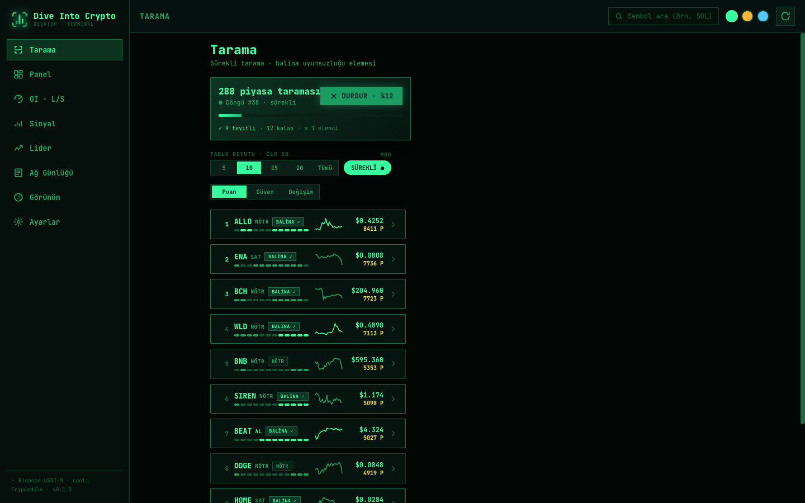
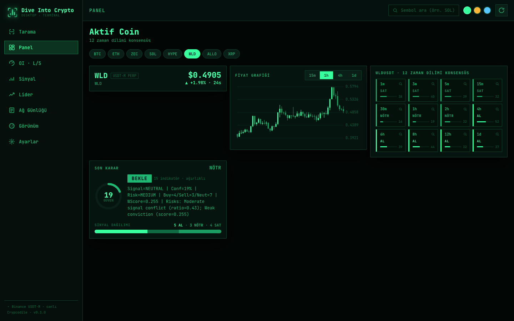

# Dive Into Crypto — Desktop Edition

A single‑window, terminal‑themed desktop scanner for Binance USDT‑M perpetual futures. The same
canonical consensus engine as the Android app (15 indicators · 12 timeframes · whale‑divergence),
fed with real, highest‑fidelity market data through
[**Crypcodile**](https://github.com/nazmiefearmutcu/Crypcodile).

| Scanner | Panel |
| --- | --- |
|  |  |

> Analysis & research tool — **not financial advice**, places **no orders**. Public data only.

---

## Quickstart

Requirements: **Python 3.12+** and [`uv`](https://docs.astral.sh/uv/). The UI ships prebuilt; you
do **not** need Node to run it.

```bash
cd desktop/backend
uv sync                  # installs the backend + Crypcodile (pinned)
uv run dive-desktop      # starts the local service on 127.0.0.1:8780 and opens the UI

# variants
uv run dive-desktop --no-open          # serve only (no browser)
uv run dive-desktop --port 8888        # custom port
```

Everything runs locally; the only network traffic is **public** Binance market‑data requests
(no account, no API keys, nothing to sign).

---

## Architecture

```
Binance public REST/WS ─┐
Deribit (IV/DVOL)      ─┤
                        ▼
                  ┌──────────────┐
                  │  Crypcodile  │  OHLCV · funding · OI · mark · IV  (data engine)
                  └──────┬───────┘
 Binance futures/data ───┤  global/top‑trader/taker long‑short ratios
                         ▼
            ┌──────────────────────────────┐
            │  backend/  (Python · FastAPI) │
            │  • engine/  15 indicators + consensus + risk  (reference parity)
            │  • data/    Crypcodile‑fed klines/OI/ratios/funding/universe
            │  • scan/    whale divergence + two‑phase ranking + eliminate/backfill
            │  • api/     REST + WS + serves the built UI
            └───────────┬──────────────────┘
                        │ JSON (data‑contract per‑symbol objects) · WS live
                        ▼
            ┌──────────────────────────────┐
            │  ui/  (React, prebuilt)       │
            │  • DesktopShell: sidebar + multi‑column, terminal themes
            │  • screens reused from the scanner UI; data.js → backend adapter
            └──────────────────────────────┘
```

### Engine parity
The backend ports the original Python reference engine (the one Android pins to). Its indicator
outputs are pinned to the Android `BTCUSDT 1h × 300` fixtures — **30/30** parity tests (signal +
score exact). Desktop and Android therefore produce the **same verdicts** on the same data.

### Honest data
Every number is real, derived from live Binance via Crypcodile. There is no mock/demo path in the
shipped app; when a data source is unavailable it is shown as unavailable (e.g. a `502` on a symbol)
rather than synthesised.

---

## Terminal themes

Three presets, switchable live from the top‑bar dots (persisted locally):

| Theme | Look |
| --- | --- |
| **Phosphor** | green CRT · low colour · scanlines |
| **Amber** | amber monochrome CRT |
| **Ice** | modern cyan minimal |

Plus live tuning in **Görünüm**: font scale, contrast, density, font family, corner radius, motion,
accent colour, candle scheme, chart type, and CRT scanlines.

---

## Screens

**Tarama** (continuous ranked scan + whale‑divergence elimination) · **Panel** (active symbol:
12‑TF consensus grid, chart, final verdict) · **OI · L/S** (open interest, long/short ratios,
quant‑bias gauge, 48‑point microstructure series) · **Sinyal** (15‑indicator table) · **Lider**
(24h gainers/losers) · **Ağ Günlüğü** (live request log) · **Görünüm** (theme) · **Ayarlar**.

---

## Development

```bash
# backend tests (offline parity + parsers)
cd desktop/backend && uv run pytest -m "not live" -q
# network‑gated tests against live Binance
uv run pytest -m live -q
# real end‑to‑end smoke (launches the server, hits live Binance)
bash tests/e2e_smoke.sh

# rebuild the UI bundle (needs Node)
cd desktop/ui && npm install && npm run build   # → ui/dist/{bundle.js, styles.css, index.html}
```

The UI is bundled with esbuild into a single offline `bundle.js` (no CDN, no in‑browser Babel).

---

## Troubleshooting

- **UI shows "Backend'e bağlanılamadı"** — the service isn't running; start it with `uv run dive-desktop`.
- **Empty scan / symbol errors** — Binance market data is geo‑restricted in some regions; this is a
  network condition, not an app bug. Try a VPN region where Binance Futures data is reachable.
- **Rate limits** — the scan caches results briefly and bounds the expensive futures‑data calls;
  rapid manual refreshes may be throttled by Binance.

## License

[MIT](../LICENSE) © nazmiefearmutcu
